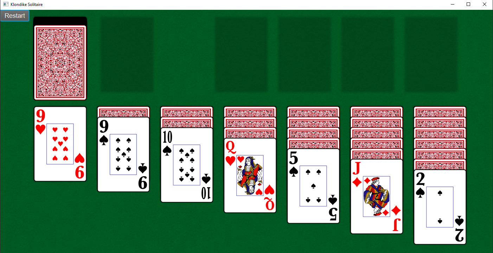

# Klondike [Solitaire](https://en.wikipedia.org/wiki/Patience_(game))

A Klondike Solitaire game written in Java using JavaFX as a GUI.

### Rules of the game

Check the rules here: http://codekata.com/kata/kata20-klondike/

## Features

* Great design and user-friendly UI
* Moving multiple cards
* Table setup
* Auto flip
* Restart
* Double click

## Requirements

* Java 10

## Screenshots

